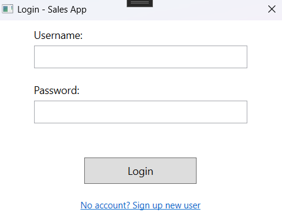
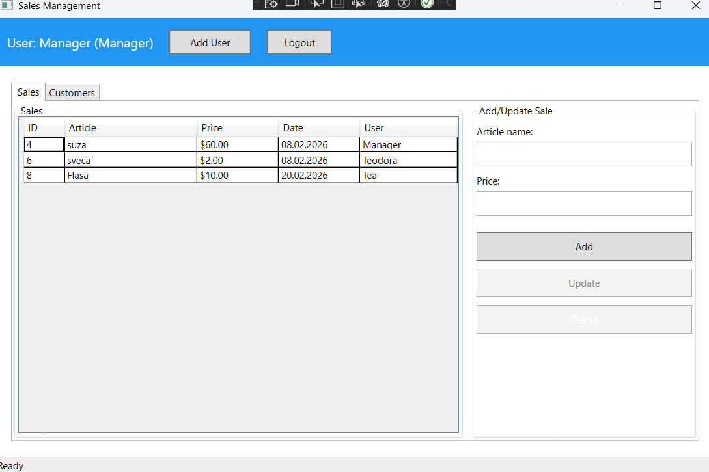
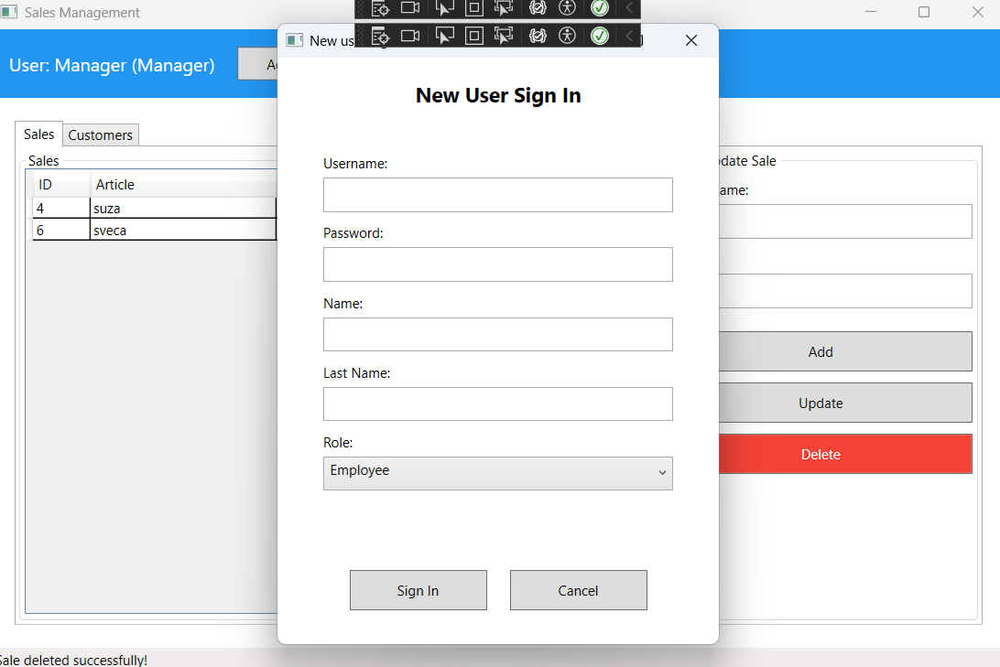
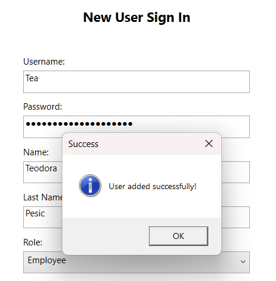
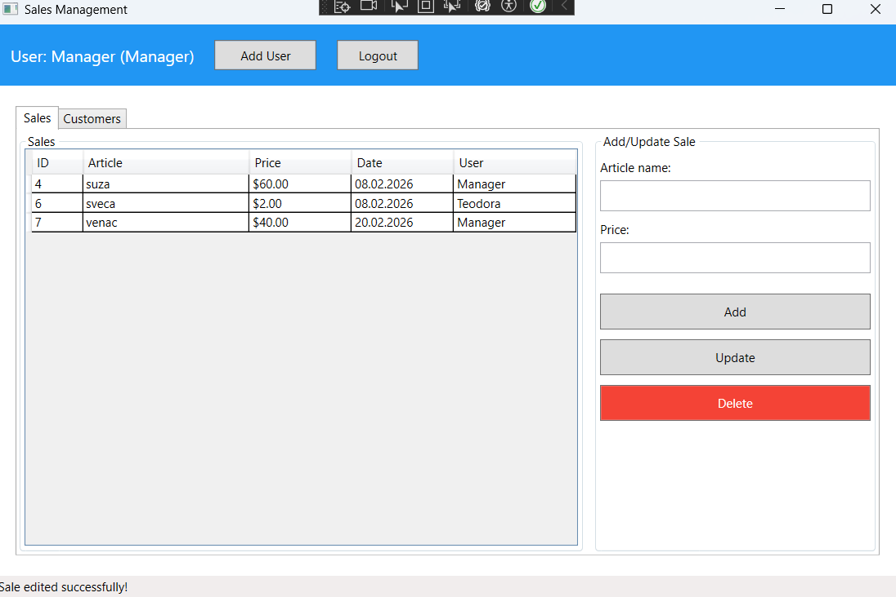
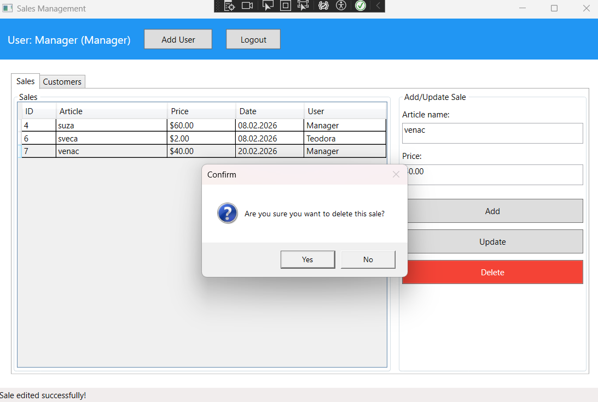
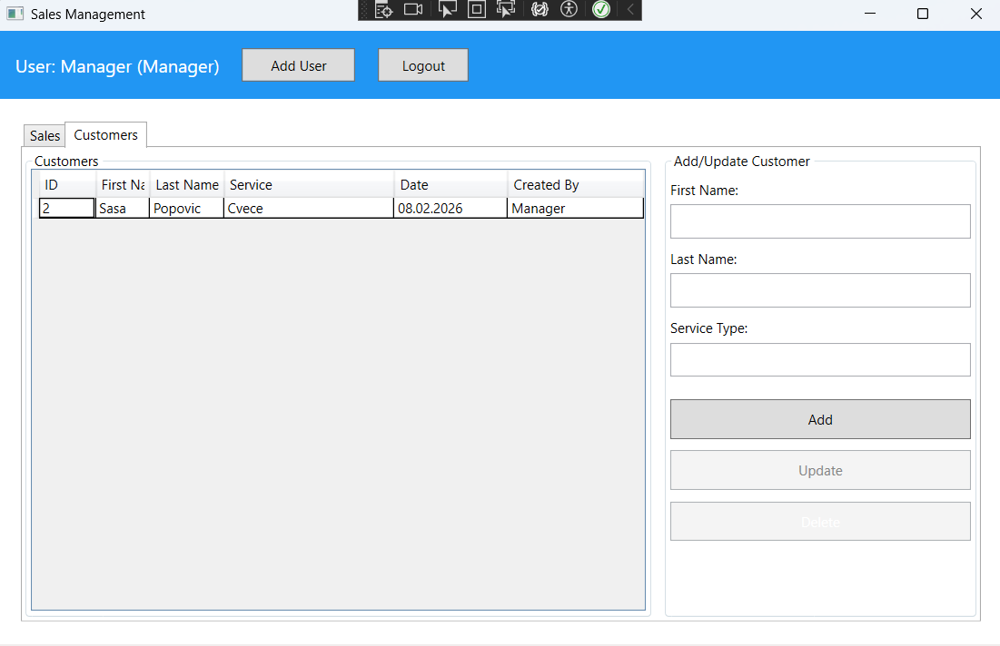
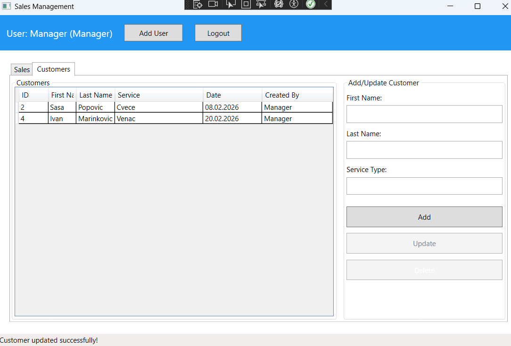
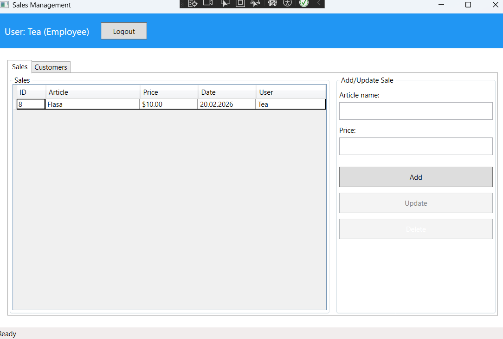
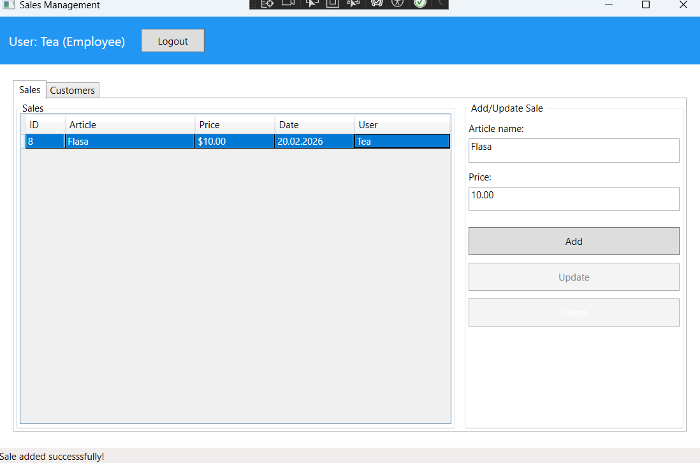

# Sales Desktop App

A desktop application for sales and customer management with role-based access control and Azure SQL integration.

**Tech Stack:**
- .NET 10.0 WPF Desktop Application
- Entity Framework Core 9.0
- Azure SQL Database
- C# with BCrypt password hashing

---

## Overview

Sales desktop App is a WPF-based application designed for small to medium businesses to manage sale transactions and customer records.
It features a secure authentication system with BCrypt password hashing and implements role-based access control for different user levels.

### Key Features

**User Authentication** - Secure login with BCrypt hashed passwords
**Role-Based Access Control** - Three user levels (Employee, Owner, Manager)
**Sales Management** - Track and manage product sales
**Customer Management** - Manage customer records and service types
**Azure SQL Integration** - Cloud-based database with automatic migrations
**Data Privacy** - User can see only their own data or all data based on role

---

## User Roles and Permissions 

|        Feature         | Employee | Owner | Manager |
|------------------------|----------|-------|---------|
| **View own sales**     |    ✅    |  ✅  |    ✅   |
| **View all sales**     |    ❌    |  ✅  |    ✅   |
| **Add sales**          |    ✅    |  ✅  |    ✅   |
| **Edit sales**         |    ❌    |  ✅  |    ✅   |
| **Delete sales**       |    ❌    |  ✅  |    ✅   |
| **View own customers** |    ✅    |  ✅  |    ✅   |
| **View all vustomers** |    ❌    |  ✅  |    ✅   |
| **Add customers**      |    ✅    |  ✅  |    ✅   |
| **Edit customers**     |    ❌    |  ✅  |    ✅   |
| **Delete customers**   |    ❌    |  ✅  |    ✅   |
| **Manage users**       |    ❌    |  ❌  |    ✅   |

---

## Technologies

- **.NET 10.0** - Modern framework for Windows desktop apps
- **WPF (XAML)** - Rich UI framework for Windows
- **Entity Framework Core 9.0** - ORM for database operations
- **Azure SQL Database** - Cloud-based relational database
- **BCrypt.Net 4.0** - Secure password hashing library
- **C#** - Primary programming language

---

## Getting Started

### Prerequisites

- [.NET 10.0 SDK](https://dotnet.microsoft.com/download/dotnet/10.0) or later
- [Visual Studio 2022](https://visualstudio.microsoft.com/) (Community, Professional, or Enterprise)
- Azure SQL Database (or SQL Server for local development)
- Windows 10/11

### Installation

1. **Clone the repository**
```powershell
   git clone https://github.com/teodorapesicar-legend/sales-app.git
   cd SalesDesktopApp
```

2. **Configure database connection**

   Copy `appsettings.EXAMPLE.json` to `appsettings.json`:
```powershell
   Copy-Item appsettings.EXAMPLE.json appsettings.json
```

   Edit `appsettings.json` with your Azure SQL credentials:
```json
   {
     "ConnectionStrings": {
       "AzureSQL": "Server=tcp:YOUR-SERVER.database.windows.net,1433;Initial Catalog=YOUR-DATABASE;User ID=YOUR-USERNAME;Password=YOUR-PASSWORD;Encrypt=True;TrustServerCertificate=False;"
     }
   }
```

3. **Apply database migrations**

   Open Package Manager Console in Visual Studio (`View` -> `Other Windows` -> `Package Manager Console`)
```powershell
   Update-Database
```

   Or using .NET CLI:
```powershell
   dotnet ef database update
```

4. **Build and run**

   Press `F5` in Visual Studio or use CLI:
```powershell
   dotnet run
```

---

## Database Schema

### Tables

**Users**
- `Id` (PK)
- `Username` (Unique)
- `PasswordHash` (BCrypt)
- `FirstName`
- `LastName`
- `Role` (Employee=1, Owner=2, Manager=3)

**Sales**
- `Id` (PK)
- `ArticleName`
- `Price`
- `SaleDate`
- `UserId` (FK -> Users)

**Customers**
- `Id` (PK)
- `FirstName`
- `LastName`
- `ServiceType`
- `DateCreated`
- `CreatedByUserId` (FK -> Users)

### Relationships
```
Users (1) ──────< (N) Sales
Users (1) ──────< (N) Customers
```

---

## Security Features

- **Password Hashing**: All passwords are hashed using BCrypt before storage
- **No Plain Text Credentials**: Connection strings stored in `appsettings.json` (excluded from Git)
- **Role-Based Authorization**: Server-side permission checks prevent unauthorized access
- **Encripted Connections**: Azure SQL uses TLS/SSL encryption
- **Input Validations**: Client-side validations prevents invalid data entry

---

## Usage Guide 

### First Time Setup

1. **Launch the application**
2. Click **"No account? Sign up new user"**
3. Create a **Manager** account (full permissions recommended for first user)
4. **Login** with your credentials

### Adding Sales

1. Navigate to **Sales** tab
2. Enter **Article Name** and **Price**
3. Click **Add** button
4. Sale is recorded with current timestamp

### Managing Customers

1. Navigate to **Customers** tab
2. Enter **First Name**, **Last Name**, and **Service Type**
3. Click **Add** button
4. Customer record is created

### Creating New Users (Manager Only)

1. Click **Add User** button in header
2. Fill in user details and select role
3. Click **Sign In** to create account

---

## Screenshots

### Login & Authentication


*Secure login with BCrypt password hashing. New users can sign up via the link below the login form.*

---

### Manager View (Full Permissions)


*Managers can view all sales from all users in the system*


*Only managers can add new users to the system (Employee/Owner/Manager roles)*


*Confirmation message after successful user creation*


*Manager editing a sale - Update button is enabled*


*Confirmation dialog before deleting a sale (Manager and Owner)*

---

### Customer Management


*Customer management interface with First Name, Last Name, Service Type, and Created By columns*


*Editing customer information - form populated with selected customer data*


*Confirmation dialog before deleting a customer*

---

### Employee View (Restricted Permissions)


*Employees can only see sales they created - notice "User: Tea (Employee)" in header*


*Update and Delete buttons are disabled/hidden for employees - demonstrating role-based UI control*

---

### Role-Based Access Control Summary

This application implements **three-tier role-based access control**:

| Role | View All Data | Add | Edit | Delete Sales | Delete Customers | Manage Users |
|------|---------------|-----|------|--------------|------------------|--------------|
| **Employee** | ❌ (own only) | ✅ | ❌ | ❌ | ❌ | ❌ |
| **Owner** | ✅ | ✅ | ✅ | ✅ | ✅ | ❌ |
| **Manager** | ✅ | ✅ | ✅ | ✅ | ✅ | ✅ |

**Key Features Shown:**
- ✅ **UI-level security**: Buttons hidden/disabled based on role
- ✅ **Server-side validation**: Backend enforces permissions
- ✅ **User context display**: Header shows current user and role
- ✅ **Confirmation dialogs**: Prevent accidental deletions
- ✅ **Success notifications**: Visual feedback for all operations

---

## Troubleshooting

### "Unable to connect to database"

**Solution:**
- Verify Azure SQL Firewall allows your IP address
  - Azure Portal -> SQL Server -> Networking -> Add client IP
- Check `appsettings.json` connection string is correct
- Ensure Azure SQL Server is running

### "Invalid object name 'Users'"

**Solution:**
- Run database migrations:
```powershell
   Update-Database
```

### "Login failed for user"

**Possible causes:**
- Incorrect username or password in `appsettings.json`
- User exists but doesn't have permissions on the specific database
- Firewall blocking the connection

**Solutions:**
- Verify SQL credentials are correct
- If using a custom SQL user (not admin), ensure they have database access:
  - Azure Portal → SQL Database → Query Editor
  - Run: `CREATE USER [your-user] FOR LOGIN [your-user];`
  - Run: `ALTER ROLE db_owner ADD MEMBER [your-user];`
- Check Azure SQL Firewall allows your IP address
---

## Project Structure
```
sales-app/
├── .gitignore
├── README.md
├── SalesApp.slnx               # Solution file
├── screenshots/                # Application UI screenshots
│   ├── 01-login-window.png
│   ├── 02-manager-all-sales.png
│   ├── 03-manager-add-user.png
│   ├── 04-user-added-success.png
│   ├── 05-manager-update-sale.png
│   ├── 06-manager-delete-sale.png
│   ├── 07-customers-tab.png
│   ├── 08-manager-update-customer.png
│   ├── 09-manager-delete-customer.png
│   ├── 10-employee-own-sales.png
│   ├── 11-employee-no-buttons.png
│   └── 12-sales-tab-view.png
└── SalesDesktopApp/
├── Data/
│   └── AppDbContext.cs         # EF Core database context
├── Migrations/                 # Database migration files
├── Models/
│   ├── Customer.cs             # Customer entity
│   ├── Sale.cs                 # Sale transaction entity
│   └── User.cs                 # User entity with roles
├── Services/
│   ├── AuthService.cs          # Authentication & authorization
│   ├── CustomerService.cs      # Customer business logic
│   └── SalesService.cs         # Sales business logic
├── App.xaml
├── App.xaml.cs                 # Application entry point
├── AssemblyInfo.cs             # Assembly metadata
├── LoginWindow.xaml
├── LoginWindow.xaml.cs         # Login screen
├── MainWindow.xaml
├── MainWindow.xaml.cs          # Main application window
├── RegisterWindow.xaml
├── RegisterWindow.xaml.cs      # User registration
├── SalesDesktopApp.csproj      # Project configuration
└── appsettings.EXAMPLE.json    # Configuration template
```

---

## Deployment

### Publishing for VM/Desktop

1. **Right-click** project -> **Publish**
2. Select **Folder** target
3. Choose **Configuration:**
   - Deployment mode: **Self-contained**
   - Target runtime: **win-x64**
   - Produce single file: **Check**
4. Click **Publish**
5. Copy `.exe` file to target machine
6. **Double-click** to run (no .NET installation required)

---

## Contributing

Contributions are welcome! Please feel free to submit a Pull Request.

1. Fork the repository
2. Create your own feature branch (`git checkout -b feature/AmazingFeature`)
3. Commit your changes (`git commit -m 'Add some AmazingFeature`)
4. Push to the branch (`git push origin feature/AmazingFeature`)
5. Open a Pull Request

---

If you find this project useful, please consider giving it a ⭐
